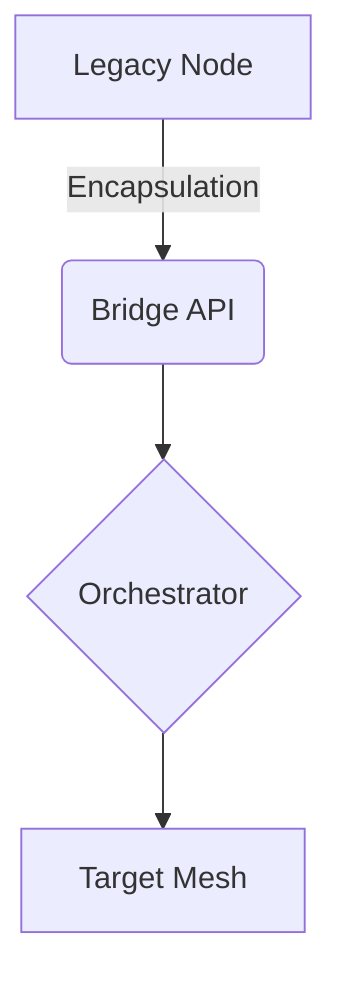

System evolution is rarely a clean slate. We are usually stitching together disparate topologies, each with its own gravity and failure modes. When merging these, the interface is the only thing that matters.



The "Bridge API" acts as a shock absorber. Without it, the entropy of the legacy system will bleed directly into your new mesh, eventually causing a total state collapse.

> "The hardest part of system design is not building the system, but preventing the existing systems from destroying the new one."

We manage this risk by enforcing strict data structures at the boundary.

```json
{
  "trace_id": "uuid-v4",
  "source_entropy": 0.42,
  "status": "constrained"
}
```