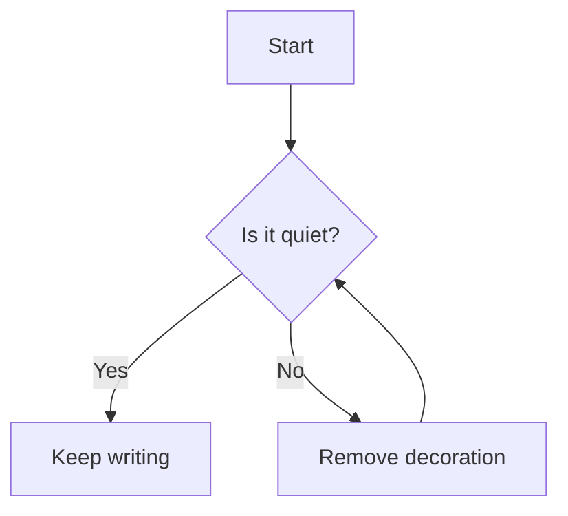
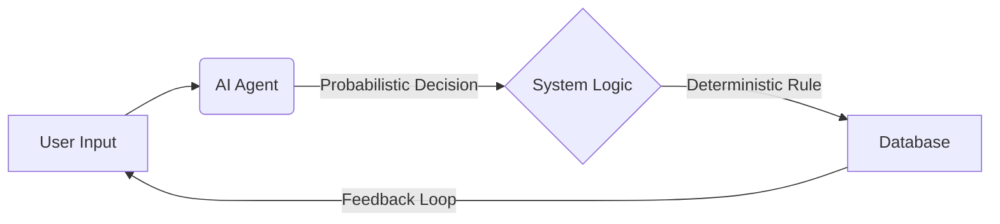

This paragraph opens without a drop cap — dark, crisp, and perfectly integrated. The abstract above is now in bold serif, tying directly to your home page’s typographic voice.

Body text remains Inter. Headings are Fraunces. The reading rhythm is clear, the TOC sticky on the left (hidden on mobile), and every element speaks the same quiet language.

> “The details are not the details. They make the design.”
> <br>— Charles Eames

> Every element on this page is optional. When a piece of content appears, it inherits the same quiet language.

## 1. The measure of text

Inline code `like this` uses a highly restrained charcoal wash. [Editorial restraint](#) is underlined in purple.


*Caption with a short rule above, warm charcoal.*
{: .img-figure }

<div class="image-grid" markdown="1">


*First of a pair*
{: .img-figure }


*Second image, auto‑gridded*
{: .img-figure }

</div>

## The anatomy of lists

Here is how a standard unordered list flows within the system. Note how the bullets are slightly muted to keep the visual focus on the words.

* **First principle:** Remove all unnecessary decoration.
* **Second principle:** Ensure the container adapts to the content, not the other way around.
* **Third principle:** Treat white space as a structural element, equal in importance to ink.

## 2. When code enters

Code blocks keep the sharp white background and Prism’s own token colours — no over‑engineering. Notice how the horizontal scroll is contained entirely within the structural border on mobile.

```python
def moving_average(values, window):
    """Return a simple moving average of given window size."""
    if window < 1:
        raise ValueError("Window must be at least 1")
    result = []
    for i in range(len(values) - window + 1):
        avg = sum(values[i:i+window]) / window
        result.append(avg)
    return result

# Example usage
prices = [22, 24, 19, 18, 21, 25, 27]
print(moving_average(prices, 3))
```

Inline `like this` keeps the muted grey background, completely neutral.

## 3. Diagrams and formulas


*No box, no border.*
{: .diagram-caption }

Another diagram:

<div class="mermaid-bleed" markdown="1">

</div>
*A wide LR graph breathing comfortably.*
{: .diagram-caption }

Math inline $\int_a^b f(x)\,dx$ and displayed:

$$
\sum_{n=1}^{\infty} \frac{1}{n^2} = \frac{\pi^2}{6}
$$

## A broader mosaic

Here is how a mixed-orientation gallery behaves when the system auto-aligns the elements.

<div class="image-gallery" markdown="1">


{: .span-2 }


{: .span-2 }

</div>

## 4. Footnotes and ending

Footnotes are classical superscript links[^1] that point to a clean list at the end.[^2]

---

If an article has no TOC, remove the `has-toc` class and the `<aside>` — the layout falls back to a single column.

[^1]: A footnote with a back‑link
[^2]: Another note, equally clean.