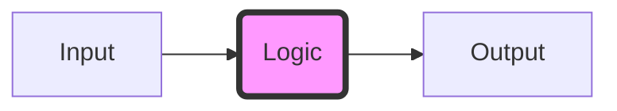

If a component can be removed without affecting the observable outcome of a transaction, it is not an optimization; it is a liability. Systems thrive on the absence of unnecessary chatter.

> "Automation does not eliminate the need for human judgment; it scales the impact of that judgment."

Every byte sent across a wire is a potential point of failure. By reducing the surface area of our internal communication, we increase the overall resilience of our architecture. This is not just about performance—it is about cognitive load. A system that is easy to reason about is a system that is easy to fix when it eventually, inevitably, breaks. 

We must treat code as a cost, not an asset. Every line of "clever" logic is a future debugging session waiting to happen. In a truly resilient environment, the most valuable engineer is the one who solves a problem by deleting a service rather than adding a new one.

If a component can be removed without affecting the observable outcome of a transaction, it is not an optimization; it is a liability. Systems thrive on the absence of unnecessary chatter.

> "Automation does not eliminate the need for human judgment; it scales the impact of that judgment."

Every byte sent across a wire is a potential point of failure. By reducing the surface area of our internal communication, we increase the overall resilience of our architecture. This is not just about performance—it is about cognitive load. A system that is easy to reason about is a system that is easy to fix when it eventually, inevitably, breaks. 

We must treat code as a cost, not an asset. Every line of "clever" logic is a future debugging session waiting to happen. In a truly resilient environment, the most valuable engineer is the one who solves a problem by deleting a service rather than adding a new one.